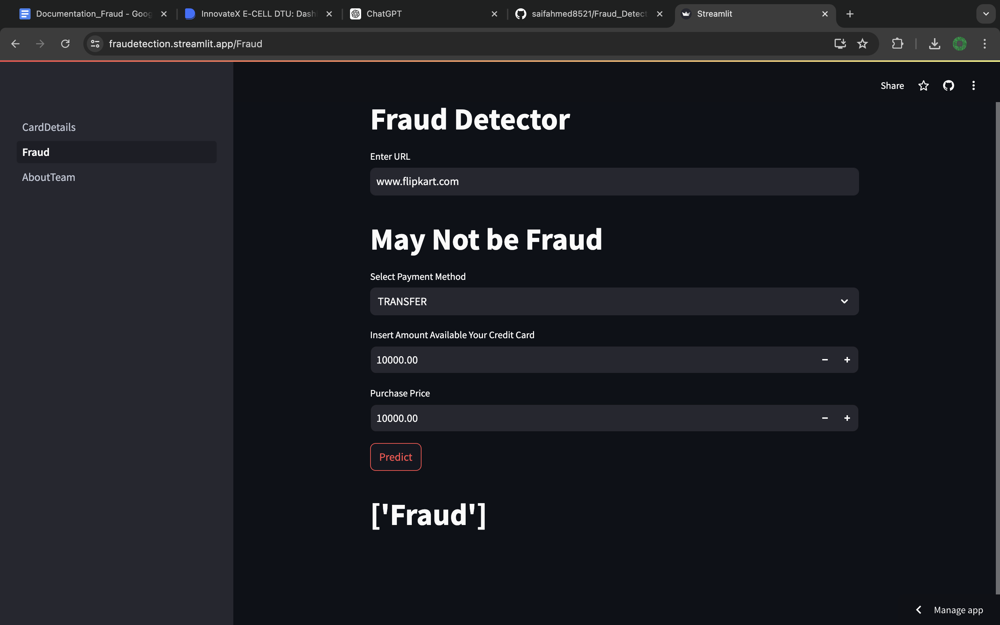

# SAFE PAY

### Description

Our AI/ML-driven credit card fraud detection system leverages advanced machine learning algorithms and real-time analysis to identify and prevent fraudulent transactions. Built using Python, TensorFlow, Scikit-learn, Pandas, and NumPy for data processing and model development, the system ensures high accuracy and scalability.For Development and Deployment we use Streamlit. This comprehensive technology stack allows us to deliver a robust, efficient, and reliable solution to enhance the security of financial transactions.


## Demo

https://fraudetection.streamlit.app/


## Documentation

[Documentation](https://docs.google.com/document/d/1-eWiJAaLO1YOR3o3QGVxIugPs9azUfDVVWoP7TTbfjk/edit?usp=sharing)


## Features

- Feature 1: Real-time Detection→ The system analyzes transactions in real-time to immediately identify and flag suspicious activities.
- Feature 2: Accuracy→ Utilizes advanced machine learning algorithms to achieve high detection accuracy with minimal false positives.
- Feature 3: User Alerts→Provides instant alerts to users and financial institutions about potentially fraudulent transactions.


## Screenshots




## Installation

```bash
pip install scikit-learn,streamlit,numpy,pandas
```
    
## Run Locally

Clone the project
Open Terminal in CreditDetails file

```bash
  streamlit run CreditDetails.py
```


## Authors

- [@Md Saif](https://github.com/saifahmed8521)
- [@Rishi](https://github.com/rishikumar1812)
- [@Aparna](https://github.com/aaparnajha)
- [@Neeraj](https://github.com/yneeraj080)


